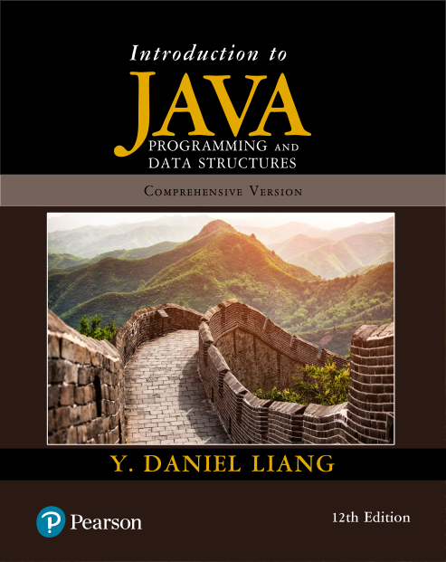

# Student Resources

This template repository contains the Java source code (with no answers to exercises), organized by chapter from _Introduction to Java Programming and Data Structures_, Comprehensive Version, 12th Edition by Y. Daniel Liang.

The purpose of this repo that mirrors the book is to allow teachers and tutors to assign book exercises to students without revealing the solutions developed by other students.

